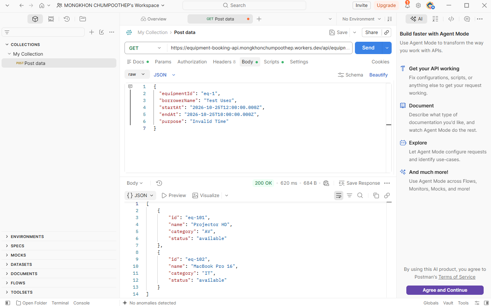
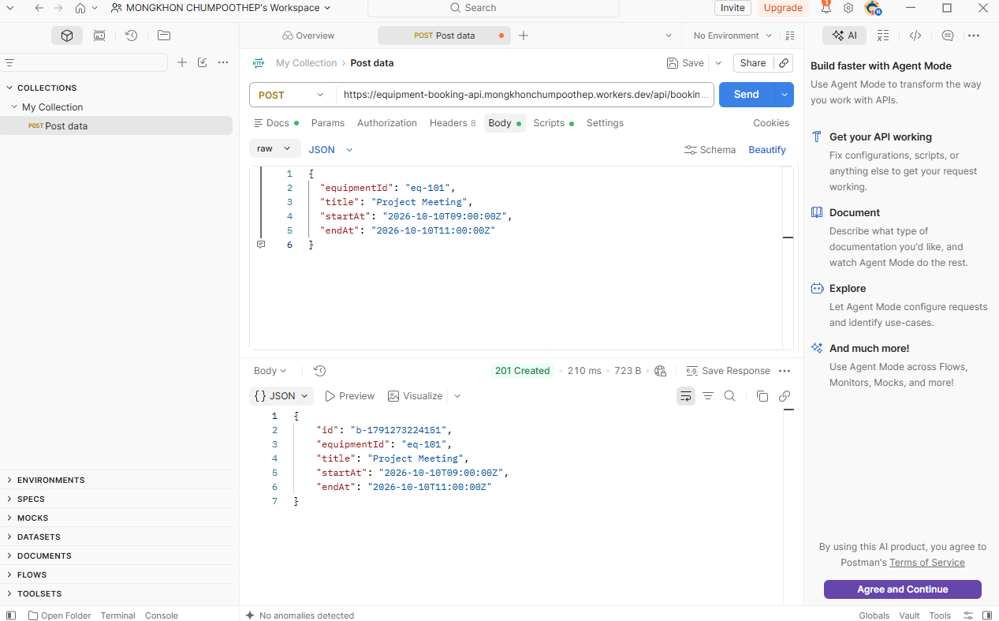
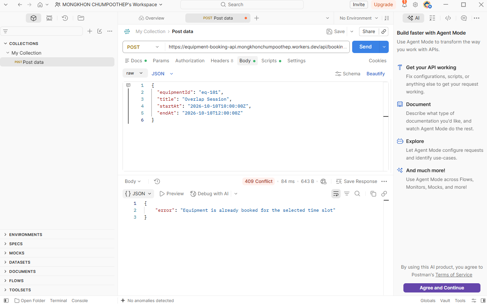
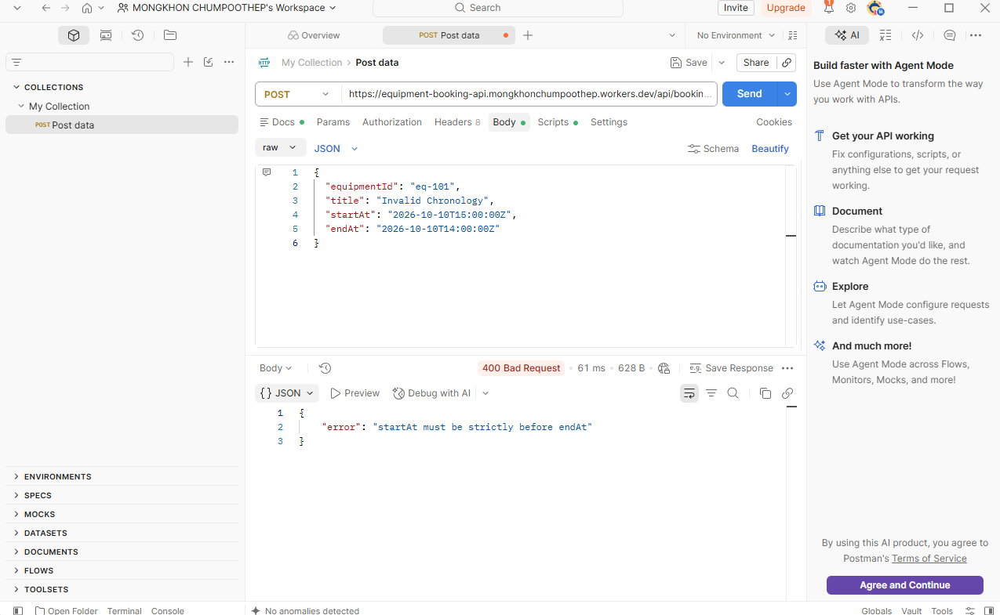
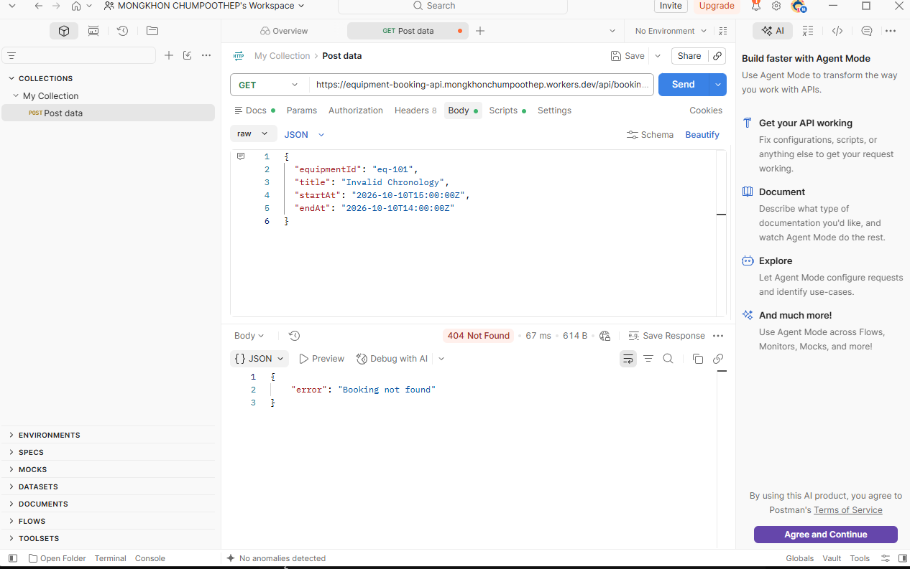

## 🛠 Database Schema & ERD

### Database Overview & Relationship
- **`equipment` (1) ─── (N) `bookings`**
  - **Relationship:** 1 ต่อ N (อุปกรณ์ 1 ชิ้น สามารถมีรายการจองได้หลายรายการ)
  - **Foreign Key:** `bookings.equipmentId` เชื่อมโยงไปที่ `equipment.id`

### Table Schemas

#### 1. `equipment` Table
| Field | Type | Constraint | Description |
| :--- | :--- | :--- | :--- |
| `id` | `TEXT` | PRIMARY KEY | Unique ID (e.g., `"eq-101"`) |
| `name` | `TEXT` | NOT NULL | Equipment Name (e.g., `"Projector HD"`) |
| `category` | `TEXT` | NOT NULL | Equipment Category (e.g., `"AV"`, `"IT"`) |
| `status` | `TEXT` | NOT NULL | Availability Status (e.g., `"available"`) |

#### 2. `bookings` Table
| Field | Type | Constraint | Description |
| :--- | :--- | :--- | :--- |
| `id` | `TEXT` | PRIMARY KEY | Unique Booking ID (e.g., `"b-1728200000000"`) |
| `equipmentId` | `TEXT` | FOREIGN KEY | Target Equipment ID (references `equipment.id`) |
| `title` | `TEXT` | NOT NULL | Purpose/Title of reservation |
| `startAt` | `TEXT` | NOT NULL | Start Time (ISO-8601 format) |
| `endAt` | `TEXT` | NOT NULL | End Time (ISO-8601 format) |

---

### SQL Table Schema
```sql
CREATE TABLE IF NOT EXISTS equipment (
  id TEXT PRIMARY KEY,
  name TEXT NOT NULL,
  category TEXT NOT NULL,
  status TEXT NOT NULL
);

CREATE TABLE IF NOT EXISTS bookings (
  id TEXT PRIMARY KEY,
  equipmentId TEXT NOT NULL,
  title TEXT NOT NULL,
  startAt TEXT NOT NULL,
  endAt TEXT NOT NULL,
  FOREIGN KEY (equipmentId) REFERENCES equipment(id)
);


Complete API Contract
1. Get All Equipment
Retrieves all equipment items available in the system.

Endpoint: /api/equipment

HTTP Method: GET

Headers: None

Request Body: None

Response 200 OK
JSON
[
  {
    "id": "eq-101",
    "name": "Projector HD",
    "category": "AV",
    "status": "available"
  },
  {
    "id": "eq-102",
    "name": "MacBook Pro 16",
    "category": "IT",
    "status": "available"
  }
]
2. Create Equipment Booking
Creates a new reservation for an equipment item after executing validation checks (Missing fields, Chronology, Existence, and Time Overlap).

Endpoint: /api/bookings

HTTP Method: POST

Headers: Content-Type: application/json

Request Body:

JSON
{
  "equipmentId": "eq-101",
  "title": "Project Meeting",
  "startAt": "2026-10-10T09:00:00Z",
  "endAt": "2026-10-10T11:00:00Z"
}
Response 201 Created
JSON
{
  "id": "b-1728200000000",
  "equipmentId": "eq-101",
  "title": "Project Meeting",
  "startAt": "2026-10-10T09:00:00Z",
  "endAt": "2026-10-10T11:00:00Z"
}
Response 400 Bad Request (Case A: Missing Required Fields)
JSON
{
  "error": "Missing required fields"
}
Response 400 Bad Request (Case B: Chronology Error startAt >= endAt)
JSON
{
  "error": "startAt must be strictly before endAt"
}
Response 404 Not Found (Equipment Does Not Exist)
JSON
{
  "error": "Equipment not found"
}
Response 409 Conflict (Overlapping Booking Time Slot)
JSON
{
  "error": "Equipment is already booked for the selected time slot"
}
3. Get Booking Details by ID
Retrieves specific booking details using the unique booking ID.

Endpoint: /api/bookings/:id

HTTP Method: GET

Headers: None

Request Body: None

Response 200 OK
JSON
{
  "id": "b-1728200000000",
  "equipmentId": "eq-101",
  "title": "Project Meeting",
  "startAt": "2026-10-10T09:00:00Z",
  "endAt": "2026-10-10T11:00:00Z"
}
Response 404 Not Found
JSON
{
  "error": "Booking not found"
}
🚀 How to Run & Deploy
1. Install Dependencies
Bash
npm install
2. Run Locally
Bash
npx wrangler dev
3. Deploy to Cloudflare Workers
Bash
npx wrangler deploy
📑 Required Documentation & Evidence
AI Usage Log: AI_LOG.md

Quality Gate Review Record: QUALITY_GATE_REVIEW.md

Test Evidence Screenshots: Located in screenshots/ folder (Cases 1 - 5)

## Test Evidence Screenshots

### Figure 1: GET Equipment List (200 OK)


### Figure 2: POST Create Booking Success (201 Created)


### Figure 3: POST Overlapping Booking Conflict (409 Conflict)


### Figure 4: POST Invalid Chronology Validation (400 Bad Request)


### Figure 5: GET Missing Booking ID (404 Not Found)

